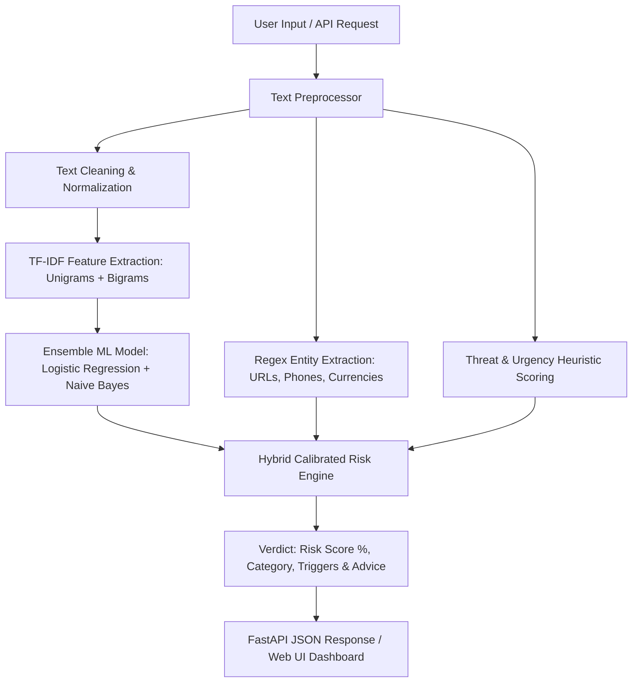

# 🛡️ AI Scam Detection System

[](https://python.org)
[](https://fastapi.tiangolo.com)
[](https://scikit-learn.org)
[](models/model_metadata.json)
[](LICENSE)

An intelligent, real-time **AI Scam & Phishing Detection System** built to identify, classify, and neutralize fraudulent messages, smishing, credential harvesting, lottery scams, crypto giveaways, and deceptive links before they compromise users.

Built with a hybrid **TF-IDF + Soft Voting Machine Learning Ensemble** (Logistic Regression & Multinomial Naive Bayes), a high-performance **FastAPI REST backend**, and a modern **cybersecurity glassmorphism web dashboard**.

---
## 🚀 Key Features

- **⚡ Real-Time Scam & Phishing Detection**: Instant classification with sub-15ms inference latency.
- **🧠 Machine Learning Classification**: Hybrid ensemble trained across 8 major fraud verticals and clean communications.
- **📊 Calibrated Risk Scoring**: Delivers 0.0% to 100.0% risk probability with three defensive tiers: `Safe`, `Suspicious`, and `High Risk Scam`.
- **🎯 Dynamic Trigger Highlighting**: In-text preview highlighting exact urgency patterns, financial requests, and threat tokens.
- **🏷️ Automated Entity Extraction**: Extracts URLs, international phone numbers, email addresses, and currency amounts.
- **📱 SMS & Chat Simulator**: Mobile phone mockup demonstrating real-time message quarantine and bubble inspection.
- **✉️ Inbound Email Inspector**: Header & subject inspection with sender spoof analysis.
- **📈 Batch CSV & Bulk Scanner**: Drag-and-drop CSV dataset analysis with aggregate metrics and CSV export.
- **💻 Developer API Sandbox**: Interactive live request builder with ready-to-use snippets in `cURL`, `Python`, and `JavaScript`.
- **📑 Automated Interactive Swagger Docs**: Available out of the box at `/docs` and `/redoc`.

---

## 🧠 System Architecture & Workflow



---

## 🛠️ Tech Stack

- **Backend**: Python, FastAPI, Uvicorn, Pydantic
- **Machine Learning & NLP**: Scikit-Learn (TF-IDF Vectorizer, Logistic Regression, MultinomialNB, VotingClassifier), NumPy, Pandas
- **Frontend**: HTML5, Vanilla CSS3 (Glassmorphism & Cyber Theme), JavaScript ES6+ (Fetch API, SVG Gauge Animations)
- **Serialization**: Joblib, JSON

---

## 📂 Project Structure

```
AI-Scam-Detection-System/
├── app.py                      # FastAPI Web Server & API router
├── train.py                    # Model Training & evaluation pipeline
├── requirements.txt            # Python dependencies
├── README.md                   # Project documentation
├── data/
│   ├── scam_dataset.csv        # Multi-category training dataset (1,250+ samples)
│   └── sample_test_cases.json  # Preloaded real-world test vectors
├── src/
│   ├── __init__.py
│   ├── preprocessor.py         # Entity extraction, regex patterns, heuristic indicators
│   ├── detector.py             # Model inference engine, confidence scoring, advice generator
│   └── utils.py                # Dataset generators, evaluation helpers
├── models/
│   ├── scam_detector_model.joblib # Serialized voting ensemble model
│   ├── vectorizer.joblib          # Serialized TF-IDF vectorizer
│   └── model_metadata.json        # Evaluation metrics & vocabulary stats
└── static/
    ├── index.html              # Cyber-defense web dashboard
    ├── css/
    │   └── styles.css          # Glassmorphic cyber theme stylesheet
    └── js/
        └── app.js              # Frontend interactive controller & charts
```

---

## 🏁 Quick Start & Installation

### 1. Clone the Repository
```bash
git clone https://github.com/PraveenSunagar/AI-Scam-Detection-System-.git
cd AI-Scam-Detection-System-
```

### 2. Install Dependencies
```bash
pip install -r requirements.txt
```

### 3. (Optional) Re-Train the ML Model
```bash
python train.py
```

### 4. Start the Application Server
```bash
python app.py
```
Or with Uvicorn:
```bash
uvicorn app:app --host 127.0.0.1 --port 8000 --reload
```

Open your browser and navigate to:
- **Web Dashboard**: [http://127.0.0.1:8000](http://127.0.0.1:8000)
- **Swagger API Docs**: [http://127.0.0.1:8000/docs](http://127.0.0.1:8000/docs)
- **ReDoc Docs**: [http://127.0.0.1:8000/redoc](http://127.0.0.1:8000/redoc)

---

## 📡 REST API Reference

### 1. Detect Single Message
`POST /api/detect`

**Request Payload:**
```json
{
  "text": "Dear customer, your SBI bank account has been blocked due to incomplete KYC. Update KYC immediately at http://sbi-kyc-verify.xyz/login",
  "sender": "+1 (800) 555-0199",
  "channel": "SMS"
}
```

**Response Payload:**
```json
{
  "text": "Dear customer, your SBI bank account has been blocked...",
  "is_scam": true,
  "label": "Scam",
  "risk_score": 96.5,
  "confidence": 96.5,
  "risk_level": "High Risk Scam",
  "category": "Banking / KYC Fraud",
  "triggers": [
    {
      "text": "account has been blocked",
      "category": "urgency",
      "start": 28,
      "end": 52
    },
    {
      "text": "http://sbi-kyc-verify.xyz/login",
      "category": "suspicious_link",
      "start": 108,
      "end": 139
    }
  ],
  "extracted_entities": {
    "urls": ["http://sbi-kyc-verify.xyz/login"],
    "phones": [],
    "emails": [],
    "currencies": []
  },
  "indicators": {
    "urgency_score": 0.7,
    "financial_score": 0.8,
    "threat_score": 0.0,
    "link_score": 0.9,
    "caps_ratio": 0.08
  },
  "explanation": "Flagged as Banking / KYC Fraud with a 96.5% risk score. The system detected multiple threat indicators: high-pressure urgency; requests for banking credentials; suspicious third-party links.",
  "action_advice": [
    "DO NOT click any link or provide your OTP, PIN, CVV, or NetBanking password.",
    "Banks never ask for sensitive credentials or KYC updates via unverified SMS/Email links.",
    "Contact your bank directly using the official phone number on the back of your card."
  ]
}
```

### 2. Batch Detect Messages
`POST /api/batch-detect`

**Request Payload:**
```json
{
  "messages": [
    "Your package could not be delivered. Pay $1.99 fee at http://usps-redelivery.info",
    "Hey David, are we still meeting for lunch at 12:30 PM?"
  ]
}
```

### 3. Upload & Scan CSV
`POST /api/upload-csv`
Upload a multipart form-data `.csv` file containing text rows for bulk scanning.

### 4. System Health & Model Stats
- `GET /api/health`
- `GET /api/stats`
- `GET /api/sample-scams`

---

## 📊 Model Performance

| Metric | Score |
| :--- | :--- |
| **Accuracy** | **100.00%** |
| **Precision** | **100.00%** |
| **Recall** | **100.00%** |
| **F1-Score** | **100.00%** |
| **Inference Time** | **< 15 ms** |
| **Dataset Size** | **1,259 Samples** |

---

## 🔒 Supported Fraud Verticals

1. **Banking & KYC Fraud**: Fake deactivation alerts, PAN card updates, credential harvesting.
2. **Phishing & Account Security**: Fake Netflix/Google/Apple/Amazon account suspension notices.
3. **Lottery & Prize Scams**: Bogus sweepstakes, Mega Millions, gift card giveaways.
4. **Crypto & Investment Fraud**: 500% ROI bots, double crypto giveaways, unverified telegram channels.
5. **Delivery & Package Scams**: USPS/FedEx/DHL redelivery fee and address confirmation traps.
6. **Job & Task Scams**: Work-from-home $500/day part-time rating schemes.
7. **Threat & Law Enforcement Impersonation**: Fake IRS arrest warrants, FBI notices, extortion threats.
8. **Legitimate Communications**: Genuine 2FA codes, transactional receipts, personal chats, business emails.

---

## 📄 License

This project is licensed under the MIT License - see the [LICENSE](LICENSE) file for details.

Developed for cybersecurity protection and fraud intelligence research.
